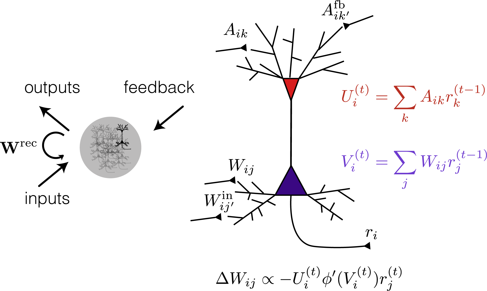

### About me
My name is Owen Marschall (he/him), and I am a PhD student in neural science :brain: at New York University, working in Cristina Savin's lab. My focus is on top-down computational work, researching principles of network computation in ways that can be applied to understanding biological networks. In particular, I train recurrent neural networks to perform tasks by a variety of methods and analyze the evolution of the learned dynamics over training. I am interested in continuing this kind of work as a postdoc.

Away from work, I am a competitive ultimate frisbee player :flying_disc:, captaining the Brooklyn-based club team Blueprint.

### Research topics
I am curious about how brains learn. I mean this "how" in two very different senses:

1) Mechanistically, how do learning signals get physically computed and communicated to synapses under biological constraints?
 
 
 
[Using local plasticity rules to train recurrent neural networks](https://arxiv.org/abs/1905.12100)  
[A unified framework of online learning algorithms for training recurrent neural networks](https://jmlr.org/beta/papers/v21/19-562.html)  
[Evaluating biological plausibility of learning algorithms the lazy way](https://openreview.net/pdf?id=HJgPEXtIUS)

2) How do these synaptic changes affect the circuit function?

 

### My code
My primary repository, vanilla-rtrl, contains NumPy-based modules for simluating vanilla recurrent neural networks doing a variety of simple tasks. The networks can be trained online using a variety of learning algorithms, optimizers, and continual learning methods. The repo also contains modules for analyzing the "journey" of an RNN's training process, allowing us to track a variety of evolving network properties over the course of learning. Details are in the README for the repo.

While lacking the raw flexibility of auto-differentiation frameworks, it is quite simple and "hands-on" to use, as one can directly interact with the quantities of interest, whether parameters or network activity. The learning process itself is transparently spelled out in NumPy operations as well, allowing one to make arbitrary tweaks to learning algorithms for research purposes.

I believe being intentional about one's workflow is crucial for efficient research and reproducibility. To this end, I have created a workflow for automatic translation between "protoype" simulations one runs in a Jupyter notebook to expensive array jobs one sends off to the NYU high-performance computers. The user can first interactively play with some cheap simulations for a given configuration, then with one command--and no risk of human error--instantly copy the same structure for up to 2000x parametric variations onto the HPC compute nodes, directly from the Jupyter notebook code.

### Interested in collaborating?
I am a self-taught coder, and I'm always eager to get help and learn from more experienced programmers. There are a few key ways my tools could be improved:
1) Making the code compatible with arbtirary RNN functions, not just vanilla RNNs and their time-continuous counterparts.
2) Generalizing the workflow to arbtirary HPC systems. This is a bit beyond my pay grade, as so many of the particulars of the NYU HPC system are hard-coded in to the way I do it, and I have no idea how to generalize. That said, there are some principles to the workflow concept that clearly could be applied to any system.

